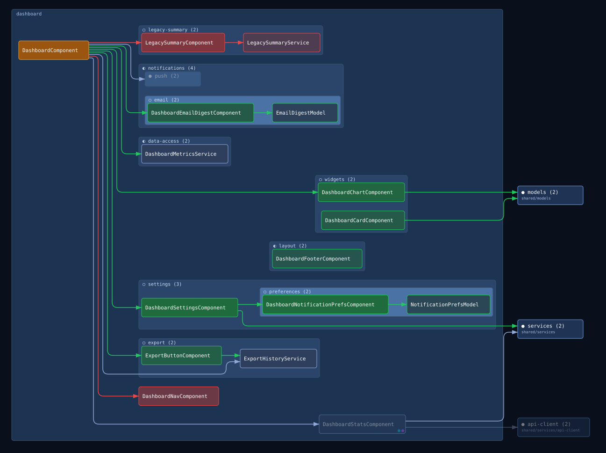
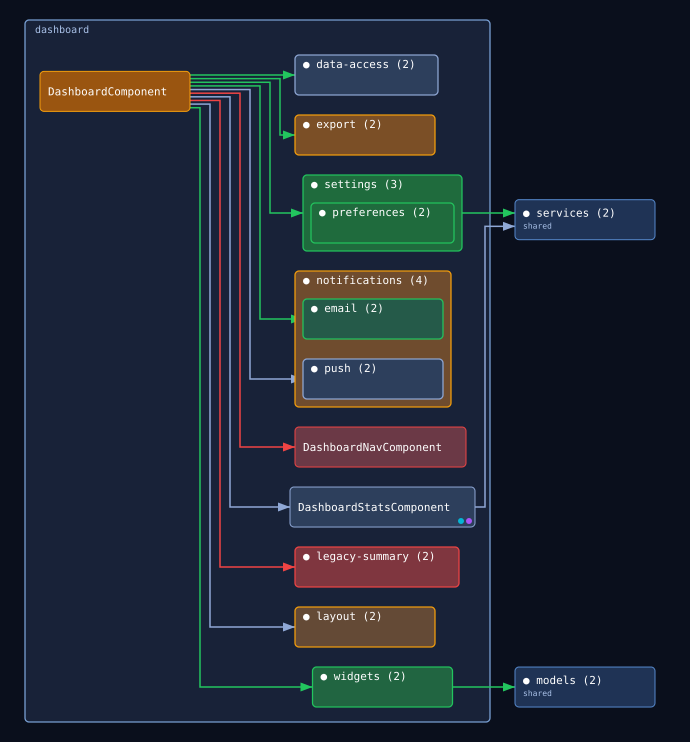
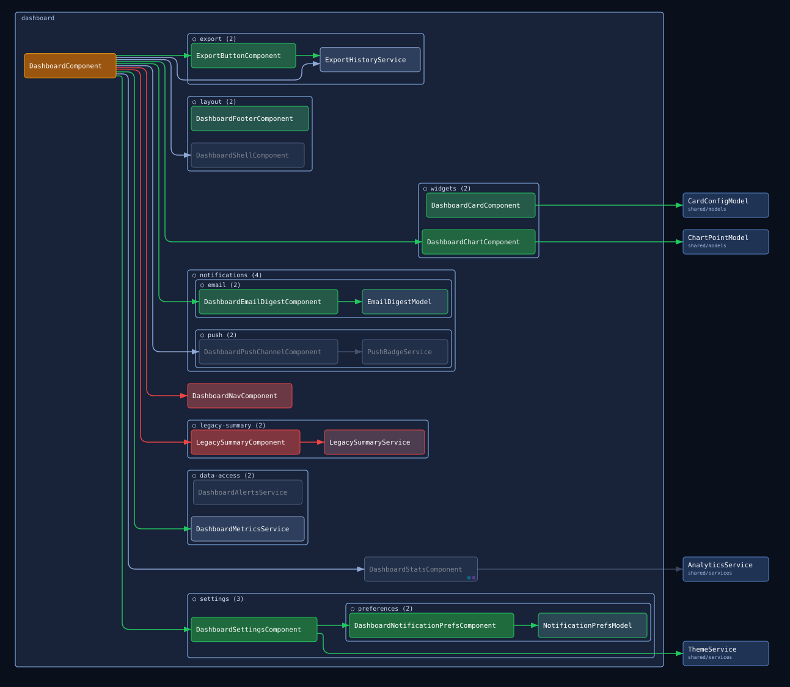

# diff-diagram

CLI tool for Angular PR review that generates a dependency diagram for a feature directory, showing what changed between branches. Parses TypeScript imports, includes one layer of dependencies outside the feature directory, diffs base vs. current, and renders a component graph.

## Reading the diagram

The tool renders three view modes from the same diff:

- **Focused** — the primary review artifact. Changed areas expand, unchanged areas collapse into a single placeholder box, so large features stay readable.
- **Collapsed** — zoomed all the way out to one box per subdirectory. Good for orienting on a feature with many files before diving into detail.
- **Expanded** — every file shown individually, no collapsing. Good for seeing the full architecture at once.

Every mode shares the same visual language:

### Visual encoding

#### Colors

Files and the arrows between them share one color key:

- **Green** — added in this PR
- **Amber** — modified (content changed)
- **Red** — removed (still drawn, so you can see what depended on it)
- **Grey** — unchanged
- A file's fill also gets lighter or darker with how much it actually changed — fullest color for the most heavily changed files, fading toward grey for small edits. A file's border always stays full color, so its diff state is never ambiguous even for a one-line tweak.

#### Containers

- **Outlined box around every file in the feature directory** — the feature directory itself, labeled with its name in the top-left corner
- **Subtle box inside it** — files grouped by subdirectory, up to 2 levels deep (e.g. `user-list/`, with a nested box for `data-access/store/`); files at the feature root, or directly in a first-level subdirectory, get no box for that level
- **Darker box outside the feature container** — a dependency from outside the feature directory, with its path shown underneath

#### Indicators

- **Cyan dot** — file has a `.spec.ts` unit test
- **Purple dot** — file has a `.stories.ts` Storybook story
- **`○` / `◐` / `●`** before a subdirectory box's name — how much of it is shown: `○` open (every file shown), `◐` partial (only the files touched by an added/removed/modified import are shown), `●` closed (collapsed to one box). Focused mode only — Expanded is always `○`, Collapsed is always `●`
- **`(N)`** after a subdirectory box's name — how many files that subdirectory actually has

### Focused

The primary review artifact: changed areas are expanded, unchanged areas collapse into a placeholder box so the diagram stays small on large features. A few things to notice in the sample below:

- **Partial collapse, from a touched edge** — `data-access/` shows only `dashboard-metrics.service.ts`, marked `◐`. Its content is unchanged, but it gained a new import from the modified `dashboard.component.ts`, so it stays visible while its untouched sibling stays hidden.
- **Partial collapse, from the file itself changing** — `layout/` shows only the newly added `dashboard-footer.component.ts`. Its sibling `dashboard-shell.component.ts` has no content change and no changed edge touching it, so it collapses away even though the directory now contains an added file — a directory isn't dragged open just because *something* in it changed.
- **Nested collapse, two levels deep** — inside `notifications/`, the `email/` subdirectory fully expands (everything in it was touched) while `push/` collapses to a single box (nothing inside changed).
- **Removed files stay visible** — both files that used to live in `legacy-summary/` are gone from the current branch, but still drawn in red so you can see what depended on them. (Expanded, further down, shows the same thing — removed files are never collapsed away in either mode.)



### Collapsed

Zooms all the way out: every subdirectory (up to 2 levels deep) becomes one box, colored `added`/`modified`/`removed`/`unchanged` — `modified` for any directory whose members don't unanimously agree on a state — useful for orienting on a feature with many files before diving into the other two modes. A few things to notice in the sample below:

- **A removed directory** — `legacy-summary/` existed only in the base branch, so its box is solid red.
- **One new file doesn't skew the whole box** — `export/` has one untouched service and one newly-added component, so its box renders amber (mixed), not green.
- **Mixed state carries up through nesting** — `notifications/` has a mixed inner state too (the whole `email/` subdirectory added, `push/` untouched), so its box is amber as well.



### Expanded

Every file shown individually with the same diff coloring, no collapsing — useful for seeing the full architecture at once, and comparing how much different files changed. A few things to notice in the sample below:

- **Fill intensity tracks size of change** — added files here range from a 1-line model to a 48-line component; the small one's green is barely tinted, the large one's is fully saturated.
- **Same for modifications** — `dashboard.component.ts` is the only modified file here, and most of its content changed, so its amber fill sits near full intensity.



## Setup

```bash
npm install
```

## Usage

```bash
node dist/cli.js \
  --repo-root <repo-root> \
  --base-repo-root <base-repo-root> \
  <feature-dir>
```

| Arg / Flag | Description | Default |
|---|---|---|
| `<feature-dir>` | Feature directory to diagram, relative to `--repo-root` | required |
| `--repo-root` | Repo root for the current branch | current working directory |
| `--base-repo-root` | Repo root for a pre-checked-out base branch | single-branch mode |
| `--out-dir` | Output directory | `dist` |
| `--source-root` | Source root prefix (used for label derivation) | `src/app` |

Run `node dist/cli.js --help` for the full usage message.

### Against the integration app fixtures

```bash
node dist/cli.js \
  --repo-root fixtures/integration-app \
  --base-repo-root fixtures/integration-app-base \
  src/app/features/users
```

### Against a real repo

Check out the base branch files to a worktree, then run:

```bash
git worktree add /tmp/base $BASE_SHA

node dist/cli.js \
  --repo-root . \
  --base-repo-root /tmp/base \
  src/app/features/my-feature
```

## What it produces

Written to `--out-dir` (`dist` by default):

| File | Purpose |
|---|---|
| `diagram-focused.svg` | Focused graph (paste as image in PR comment); written only when `--base-repo-root` is given |
| `diagram-expanded.svg` | Expanded graph, same diff coloring, no collapsing |
| `diagram-collapsed.svg` | Directory-only zoomed-out graph — one box per subdirectory (up to 2 levels deep), colored by its members' diff state (unanimous, else modified) |
| `diagram.html` | Interactive diagram with mode switching and hover highlights |
| `graph.json` | Full diffed graph JSON for downstream tooling |

## Development

```bash
npm test                      # unit + integration tests
npm run test:visual           # visual regression tests (pixel-level SVG comparison)
npm run test:visual:approve   # update visual regression snapshots after intentional changes
npm run build                 # compile TypeScript → dist/ (required before running the CLI)
npm run verify                # full check: build + lint + unit tests + visual tests (runs on pre-commit)
```

Tests are colocated with source files in `src/`.

## Fixture apps

Fixture apps live under `fixtures/`.

### Integration app

`fixtures/integration-app/` — "after PR" state  
`fixtures/integration-app-base/` — "before PR" state

Fixture diff:
- 3 files added in `user-settings/` — two components plus a small model, deliberately sized apart to show the change-magnitude gradient's range
- 1 file removed in `user-list/`
- 4 files modified — three small, one substantially larger, also demonstrating the gradient
- A Storybook story and an out-of-scope `shared/services` barrel added in the current branch

Used by the integration and visual regression tests.

### Sample app

`fixtures/sample-app/` — "after PR" state for the "Reading the diagram" samples above  
`fixtures/sample-app-base/` — "before PR" state for the same samples

Structure:
- 3 files at the dashboard feature's root
- `widgets/`, `settings/` (with a nested `settings/preferences/`), `layout/`, `data-access/`, `export/`, and `notifications/` (with nested `email/`/`push/`) subdirectories
- A `legacy-summary/` directory present only in the base branch

Designed so `npm run diagram:sample` produces one diagram containing every visual element the renderer can produce — added/modified/removed/unchanged nodes, out-of-scope dependencies, test/story markers, and both first- and second-level subdirectory group boxes. See "Reading the diagram" above for what each directory specifically demonstrates. Not used by any automated test.

The images in "Reading the diagram" are regenerated from this fixture pair by `npm run docs:sample:generate` (build first: the script assumes `dist/` is current).

## Architecture

See [docs/architecture.md](./docs/architecture.md) for the full module reference. See [docs/glossary.md](./docs/glossary.md) for term definitions.

```
analyze(base) ──┐
                ├─▶ diffGraphs ──▶ computeViewNodes ──▶ computeLayout ──▶ toSvg / HTML
analyze(current)┘
```

| Module | Responsibility |
|---|---|
| `src/analyzer.ts` | ts-morph: enumerate `.ts` files, extract imports, build Graph |
| `src/filter.ts` | Add one layer of out-of-scope context nodes |
| `src/diff-parser.ts` | `diffGraphs(base, current)`: compare graphs, assign diff states |
| `src/renderer/graph-helpers.ts` | `computeViewNodes(graph, mode)`: collapse unchanged dirs to stubs |
| `src/renderer/layout.ts` | `computeLayout(nodes, edges)`: elkjs wrapper, returns positions |
| `src/renderer/draw.ts` | `toSvg(...)`: pure SVG string from pre-computed layout |
| `src/cli.ts` | Orchestration: args, two-pass analysis, diff, layout, file writes |
| `src/renderer.html` | Browser shell: reads embedded JSON, renders SVG, hover, mode switch |
