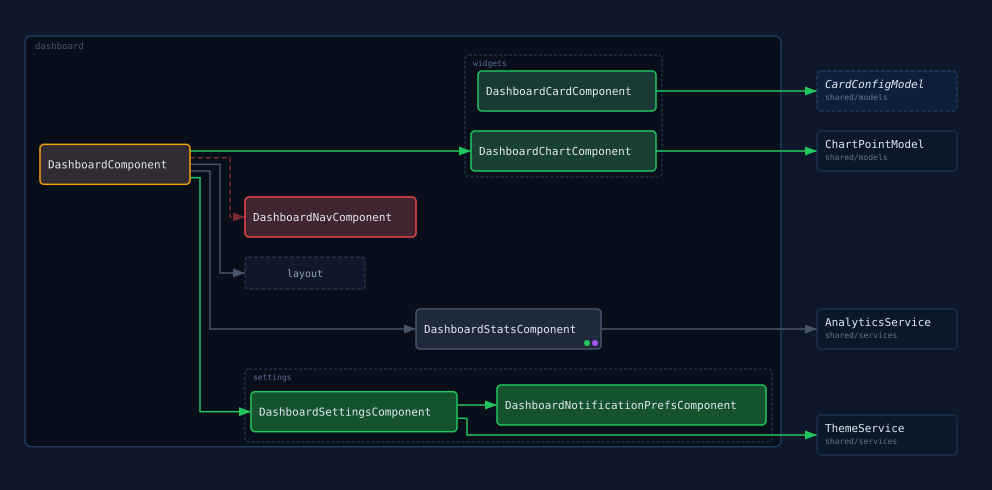
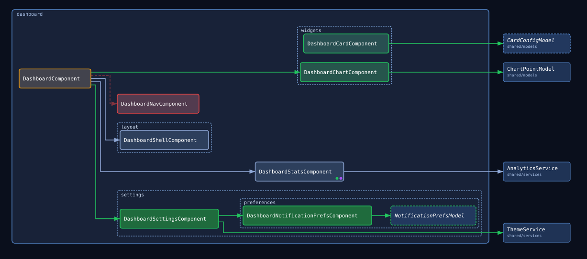

# diff-diagram

CLI tool for Angular PR review that generates a dependency diagram for a feature directory, showing what changed between branches. Parses TypeScript imports, includes one layer of dependencies outside the feature directory, diffs base vs. current, and renders a component graph.

## What it produces

| File | Purpose |
|---|---|
| `dist/diagram-diff.svg` | Diff-focused graph (paste as image in PR comment); written only when `--base-repo-root` is given |
| `dist/diagram-all.svg` | All-nodes graph, same diff coloring, no collapsing |
| `dist/diagram.html` | Interactive diagram with mode switching and hover highlights |
| `dist/graph.json` | Full diffed graph JSON for downstream tooling |

## Reading the diagram

The tool renders two view modes from the same diff. **Diff-focused** is the primary review artifact: changed areas are expanded, unchanged areas collapse into stub nodes so the diagram stays small on large features. **All-nodes** shows every file individually with the same diff coloring — useful for seeing the full architecture at once.





Both samples above are generated from the `sample-app/` + `sample-app-base/` fixture pair by `npm run docs:sample:generate` (build first: the script assumes `dist/` is current). They show every visual element the tool renders:

| Element | Meaning |
|---|---|
| Green border, dark green fill | File added in this PR |
| Amber border, dark amber fill | File modified in this PR (its content changed) |
| Red border, dark red fill | File removed in this PR (kept as a ghost so you can see what pointed at it) |
| Grey border, slate fill | File unchanged |
| Fill intensity, within a diff color | Change magnitude — how much of the file changed, relative to the most heavily changed files in the diagram. The border always shows full diff-state color regardless of magnitude; only the fill fades toward the unchanged slate for smaller edits, so a one-line tweak stays visually distinct from a full rewrite. |
| Darker box outside the feature container | Out-of-scope dependency (imported from outside the feature directory), with its directory path under the name |
| Dashed border, italic name | Type-only dependency (every import of it is `import type`) |
| Solid arrow | Import; color follows its diff state (green added, amber changed, grey unchanged) |
| Dashed, faded, red arrow | Removed import (existed in the base branch, gone in current) |
| Green dot | File has a unit test (`.spec.ts` sidecar) |
| Purple dot | File has a Storybook story (`.stories.ts` sidecar) |
| Outlined box around the in-scope files | The feature directory being diagrammed, labeled with its name in the top-left corner |
| Dashed subtle box inside the feature container | Files grouped by first-level subdirectory (e.g. `user-list/`); files at the feature root get no box |

## Setup

```bash
npm install
```

## Usage

```bash
node dist/cli.js \
  --repo-root <repo-root> \
  --base-repo-root <base-repo-root> \
  <feature-dir>
```

| Arg / Flag | Description | Default |
|---|---|---|
| `<feature-dir>` | Feature directory to diagram, relative to `--repo-root` | required |
| `--repo-root` | Repo root for the current branch | current working directory |
| `--base-repo-root` | Repo root for a pre-checked-out base branch | single-branch mode |
| `--out-dir` | Output directory | `dist` |
| `--source-root` | Source root prefix (used for label derivation) | `src/app` |

Run `node dist/cli.js --help` for the full usage message.

### Against the fake app fixtures

```bash
node dist/cli.js \
  --repo-root fake-angular-app \
  --base-repo-root fake-angular-app-base \
  src/app/features/users
```

### Against a real repo

Check out the base branch files to a worktree, then run:

```bash
git worktree add /tmp/base $BASE_SHA

node dist/cli.js \
  --repo-root . \
  --base-repo-root /tmp/base \
  src/app/features/my-feature
```

## Development

```bash
npm test                      # unit + integration tests
npm run test:visual           # visual regression tests (pixel-level SVG comparison)
npm run test:visual:approve   # update visual regression snapshots after intentional changes
npm run build                 # compile TypeScript → dist/ (required before running the CLI)
npm run verify                # full check: build + lint + unit tests + visual tests (runs on pre-commit)
```

Tests are colocated with source files in `src/`.

## Fixture apps

`fake-angular-app/` — "after PR" state  
`fake-angular-app-base/` — "before PR" state

Fixture diff: three files added in `user-settings/` (two components plus a small model, deliberately sized apart to show the change-magnitude gradient's range), one removed in `user-list/`, four files modified (three small, one substantially larger — also demonstrating the gradient), plus a Storybook story and an out-of-scope `shared/services` barrel added in the current branch. Used by the integration and visual regression tests.

`sample-app/` — "after PR" state for the "Reading the diagram" sample above  
`sample-app-base/` — "before PR" state for the "Reading the diagram" sample above

Fixture diff: designed so `npm run diagram:sample` produces one diagram containing every visual element the renderer can produce (added/modified/removed/unchanged nodes, out-of-scope and type-only dependencies, test/story markers, and subdirectory group boxes). The dashboard feature has 3 files at its root, a `widgets/` subdirectory (2 files), a `settings/` subdirectory (1 root file plus a nested `settings/preferences/` file, demonstrating that nested files still group under their first-level subdirectory), and a `layout/` subdirectory whose one file is unchanged between branches — the only subdirectory diff-focused mode collapses to a stub, so it's the one place the two sample images above actually differ. Not used by any automated test.

## Architecture

See [docs/architecture.md](./docs/architecture.md) for the full module reference. See [docs/glossary.md](./docs/glossary.md) for term definitions.

```
analyze(base) ──┐
                ├─▶ diffGraphs ──▶ computeViewNodes ──▶ computeLayout ──▶ toSvg / HTML
analyze(current)┘
```

| Module | Responsibility |
|---|---|
| `src/analyzer.ts` | ts-morph: enumerate `.ts` files, extract imports, build Graph |
| `src/filter.ts` | Add one layer of out-of-scope context nodes |
| `src/diff-parser.ts` | `diffGraphs(base, current)`: compare graphs, assign diff states |
| `src/renderer/graph-helpers.ts` | `computeViewNodes(graph, mode)`: collapse unchanged dirs to stubs |
| `src/renderer/layout.ts` | `computeLayout(nodes, edges)`: elkjs wrapper, returns positions |
| `src/renderer/draw.ts` | `toSvg(...)`: pure SVG string from pre-computed layout |
| `src/cli.ts` | Orchestration: args, two-pass analysis, diff, layout, file writes |
| `src/renderer.html` | Browser shell: reads embedded JSON, renders SVG, hover, mode switch |
